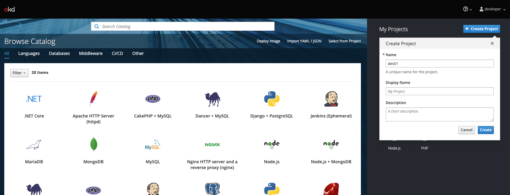

# 複数コンテナの連携

- テンプレートからMongoDBを構築
- テンプレートからNode.jsアプリケーションを作成
- Node.jsアプリケーションのsecretを設定し、MongoDBと繋げる

# MongoDBを構築
Node.jsアプリケーションを作成し、MongoDBと接続する上で必要な情報を設定し連携させます。まずはMongoDBから構築していきます。

1. 任意のプロジェクトを選択します

    ないプロジェクトは右上の"+ Create Project"で任意のプロジェクト名（以下の例では dev01)を入力"Create"してください。

    

1. Catalog > Developer Catalog > と選択し、「mongodb (ephemeral)」と検索し、MongoDB(Ephemeral)を選択してください。

    

1. Create Service Instanceをクリックしたら下記のような画面になります。そのままCreateをクリックしてください。
  
    

1. 「Create Service Binding」を選択します。

    

1. 「Service Binding Name」が下記のように「mongodb-ephemeral」のようになっているはずなので、そのままCreateを選択してください。

    

1. 下記画面に遷移しますので、「SECRET」の「mongodb-ephemeral」のリンクを選択してください。(作成されるまで多少時間が掛かります)

    

1. 下にスクロールし、右側の「Reveal Values」を選択し、表示されたユーザー名やパスワード全てをメモしておいてください。後でアプリケーションの設定をする時に必要となります。

    

# Node.jsアプリケーションを構築

1. 次にNode.jsのアプリケーションを構築します。Catalog > Developer Catalog > Languages > JavaScript と進み、

   Node.jsを選択してください。(Node.js + MongoDBや、Node.js + MongoDB(Ephemeral)ではありません)

   

2. Create Applicationを選択したら、下記のように Nameは「ユーザー名-multi-pod-app」、Git Repositoryには

   「https://github.com/openshift/nodejs-ex.git」を入れ、Createを選択してください。

   

3. 次にアプリケーションへのRouteを作成します。Networking > Routes > Create Route と進み、

   Nameに「ユーザー名-multi-pod-app」、Service も同様に「ユーザー名-multi-pod-app」を選択、

   Target Port は「8080 -> 8080 (TCP)」を選択してCreateしてください。

   

4. Networking > Routes と進むと、今作成したRouteが表示されます。Locationのリンクを選択するとアプリケーションのデフォルトページに遷移します。右下の「Page view count」が「No database configured」になっていることを確認してください。

   

# Node.jsとMongoDBを繋げる

1. 最後に作成したNode.jsアプリケーションからMongoDBに接続する設定を行います。

   Deployment Configs > ユーザー名-multi-pod-app > Environment と進んでください。

   ここで Single values (env) の下にNAME, VALUEと入力できる箇所があるので、以前MongoDB構築時にメモした値を入れていきます。それぞれ下記のように入れていきます。

   | NAME                   | VALUE                            |
   | ---------------------- | -------------------------------- |
   | MONGODB_USER           | USERNAMEに表示されていた値       |
   | MONGODB_DATABASE       | DATABASE_NAMEに表示されていた値  |
   | MONGODB_PASSWORD       | PASSWORDに表示されていた値       |
   | MONGODB_ADMIN_PASSWORD | ADMIN_PASSWORDに表示されていた値 |
   | DATABASE_SERVICE_NAME  | mongodb (固定値)                 |

   

2. 設定が終わったら、先ほどのアプリケーションのページに遷移してください。下記のようにPage view countが加算されるようになれば設定成功です。設定が反映されるまで時間がかかるので、うまくいかない場合はしばらくたってからリロードして確認してください。

   

